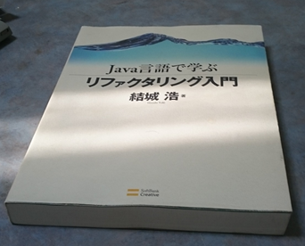

======================================
本のスキャン
======================================

----------------------------------------
カバーのスキャン（B5サイズ以上）
----------------------------------------
フラットベースのスキャナで読み取る場合を説明します。

1. スキャナのふたを開け、読み取りたい面を裏にし、カバーの上をふたの開けた方向に向けます。
  - 感覚として、スキャンの向きはセットした逆の結果になります。
  - スキャナの設定として、180度回転して読み取ることもできますが、ScanSnapも同様の向きなので慣れれば問題ないと思います。

   
   解体前の本

2. EPSON製の場合、「Document Capture Pro」を起動します。
  - 事前にジョブの作成しておきます。
  - 詳細は、「 :doc:`scanner` 」を参照してください。

3. Document Capture Proのジョブを「技術書[カバー用][カラー]」を選択します、「ジョブの実行」アイコンをクリックします。
  - 2分割にしたカバーの両方を読み取ります。

4. 読み取った画像の補正（傾き、トリミング、色合い）を行います。
  - ちょっとした補正であれば、Windows10からの標準アプリとなった「フォト」で十分に加工できます。
  - フォトの使い方は、「 :doc:`photo` 」を参照してください。

----------------------------------------
カバーのスキャン（単行本サイズ）
----------------------------------------

単行サイズの場合、通常のスキャン方法では長すぎるため、特別な方法で読み込みます。

1. ScanSnapの読み取り設定を、「カバー用」に設定します。
  - 

2. カバーを裏面にして、ScanSnapに設定します。
3. ScanSnap本体の読み取りボタンを点滅するまで長押し（3秒程度）します。

----------------------------------------
本体のスキャン
----------------------------------------

