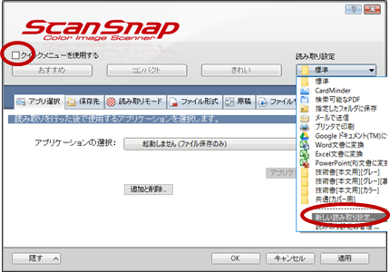
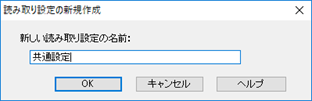
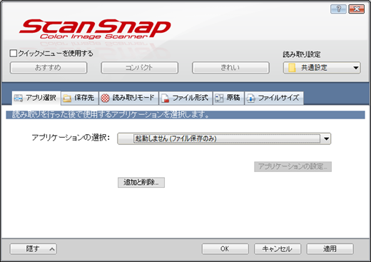
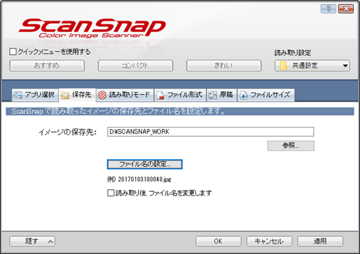
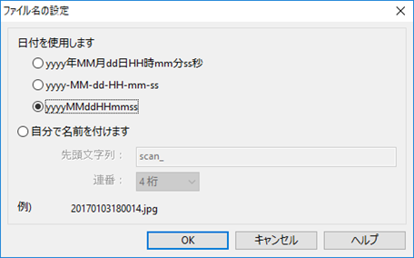
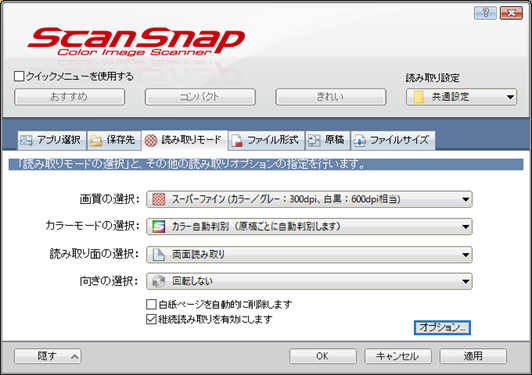
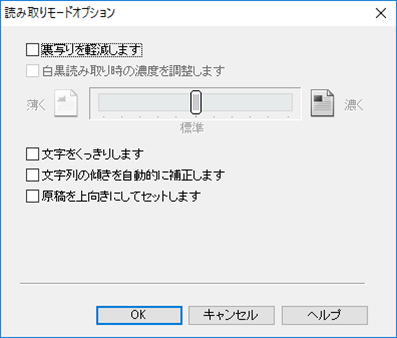
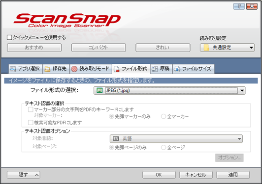
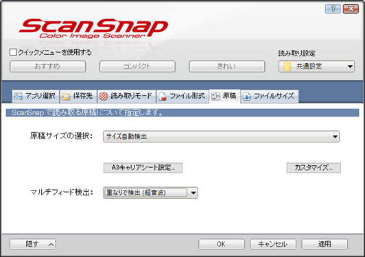
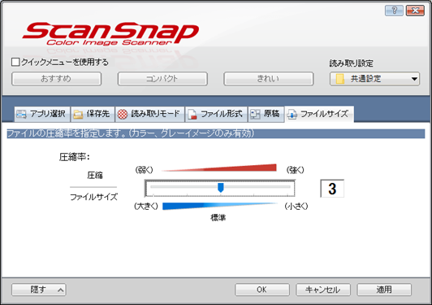

----------------------------------------
基本設定
----------------------------------------

1. ScanSnap Managerを起動します。
2. 「クイックメニューを使用する」のチェックをはずし、「読み取り設定」のプルダウンから、「新しい読み取り設定...」を選択します。

   
   新しい読み取り設定

3. 読み取り設定の名称を「共通設定」など適当に付けます。

   
   読み取り設定の名称

以下、詳細の設定を行っていきます。

^^^^^^^^^^^^^^^^^^^^^^^^^^^^^^^^
「アプリ選択」の設定
^^^^^^^^^^^^^^^^^^^^^^^^^^^^^^^^

「アプリ選択」は、何も設定しません。

   
   アプリ選択

^^^^^^^^^^^^^^^^^^^^^^^^^^^^^^^^
「保存先」の設定
^^^^^^^^^^^^^^^^^^^^^^^^^^^^^^^^

1. 「イメージの保存先」として、好きな箇所に設定します。自身は、Dドライブの浅い箇所に設定しています。

   
   保存先の設定

2. 「ファイル名」の設定として、「yyyyMMddHHmmss」を選択します。

   
   ファイル名の設定

^^^^^^^^^^^^^^^^^^^^^^^^^^^^^^^^
「読み取りモード」の設定
^^^^^^^^^^^^^^^^^^^^^^^^^^^^^^^^

1. 画質の選択などを行います。

   a. 「画質の選択」として、「スーパーファイン」を選択します。iPadで読む場合も、基本的に300dpiで十分です。
   b. 「カラーモードの選択」として、「カラー自動判別」を選択します。
   c. 「読み取り面の選択」として、「両面読み取り」を選択します。
   d. 「向きの選択」として、「回転しない」を選択します。
   e. 「白紙ページを自動的に削除します」のチェックを外します。
   f. 「継続読み取りを有効にします」にチェックします。

   
   読み取りモードの設定

2. 「オプション」の設定として、全てのチェックを外します。

   
   読み取りモードのオプションの設定

^^^^^^^^^^^^^^^^^^^^^^^^^^^^^^^^
「ファイル形式」の設定
^^^^^^^^^^^^^^^^^^^^^^^^^^^^^^^^

「ファイル形式」は、JPEGを選択します。
PDF化やOCRによる文字認識は、後で他のアプリを使って行うため、画像として読み込みます。

   
   ファイル形式

^^^^^^^^^^^^^^^^^^^^^^^^^^^^^^^^
「原稿」の設定
^^^^^^^^^^^^^^^^^^^^^^^^^^^^^^^^

1. 「原稿静の選択」は、「サイズの自動検出」を選択します。
2. 「マルチフィード検出」は、「重なりで検出（超音波）」を選択します。

   
   原稿の設定

^^^^^^^^^^^^^^^^^^^^^^^^^^^^^^^^
「ファイルサイズ」の設定
^^^^^^^^^^^^^^^^^^^^^^^^^^^^^^^^

ファイルサイズとして「3」を設定します。

   
   ファイルサイズの設定

