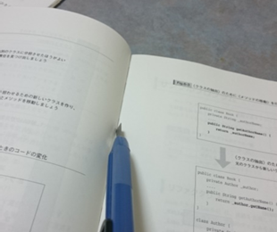

======================================
本の解体
======================================

B5サイズの本を例に解体していきます。
本格的にJavaの開発を始めたときに、非常にお世話になった本です。

.. figure:: ./_static/split/before.png
   :align: center
   
   解体前の本

----------------------------------------
準備
----------------------------------------
解体の前の準備として、次の内容を確認します。

1. 付箋が貼ってあれば、はがします。
2. しおりや、申し込みはがきなどが挟まれていれば取り出します。
3. ドッグイヤー（ページの角を折る）があれば、戻します。

   
   ドッグイヤーを戻す

----------------------------------------
見返しの剥離
----------------------------------------
見返し（中身と表紙をつなぐ紙）を取り外します。

1. 見返しの糊付け部分が取れるまで引っ張ります。

   
   見返しの剥離

2. 反対側の見返しも同様に引っ張ります。

   
   反対側の見返しの剥離

3. 両方の見返し部分を引っ張り、完全に剥離します。
   半分まで剥離できたら、反対側に持ち替えて引っ張ると、綺麗にできます。

.. figure:: ./_static/split/inside_cover_03.png
   :align: center
   
   見返しの完全な分離

----------------------------------------
本体の分割
----------------------------------------
50～80ページ（25～40枚）ずつに分割します。
このページ数は裁断機の能力に依存するため、使用する機器により変動します。
また、使用されている紙の厚さにもよるため、本により調節する必要があります。

「:doc:`概要 <outline>` 」で紹介した裁断機の場合は、上限が40枚（80ページ）ですが、
紙の厚さにもよるため、30枚（60ページ）を目安にすれば多くの本に対応できます。

1. 分割する部分のページを押さえつけて、しっかり開きます。

.. figure:: ./_static/split/body_01.png
   :align: center
   
   分割箇所でページをしっかり開く

2. カッターナイフで糊付け部分が剥離できるまで切っていきます。
   古い本の場合、糊が劣化しているため、手で押さえたり、引っ張るだけで糊付け部分が剥離できます。

   
   糊付け部分の剥離

3. カッターナイフの刃を立てて、切れ目を入れていき分割します。
   
.. figure:: ./_static/split/body_03.png
   :align: center
   
   本体の分割
   
4. これを繰り返していきます。

.. figure:: ./_static/split/body_04.png
   :align: center
   
   本体の分割

----------------------------------------
本体の裁断
----------------------------------------
糊付け部分を境に裁断機で裁断します。
糊付け部分が残ると、ドキュメントスキャナで読み取るときに、重送・紙詰まりのもととなるため、余裕を持って **1cm** で切り取ります。

1. 裁断機に本体を設定します。ガイドラインに沿って、その際に1cm程度ずらします。
   ページの枚数が多いとセットできないため、そのときは、さらに分割します。

.. figure:: ./_static/split/body_split_01.png
   :align: center
   
   裁断機のセット

2. スライダーを前後に3～4回スライドさせて、裁断します。

   
   裁断

----------------------------------------
表紙の分割
----------------------------------------

単行本（A5）サイズの場合は、ScanSnapでそのまま取り込めるため、表紙の分割は必要ありません。

1. B5サイズ以上の本の場合、ScanSnapでそのままでは取り込めないため分割します。

.. figure:: ./_static/split/cover_split_01.png
   :align: center
   
   表紙の分割

2. ScanSnapで取り込めるようにさらに分割します。

.. figure:: ./_static/split/cover_split_02.png
   :align: center
   
   表紙のさらなる分割

.. note::
   
   表紙をScanSnapで取り込めるサイズに分割が面倒な場合があります。
   綺麗さにあまりこだわらなければ、フラットベースの通常のスキャナで取り込めサイズの2分割でよいです。

